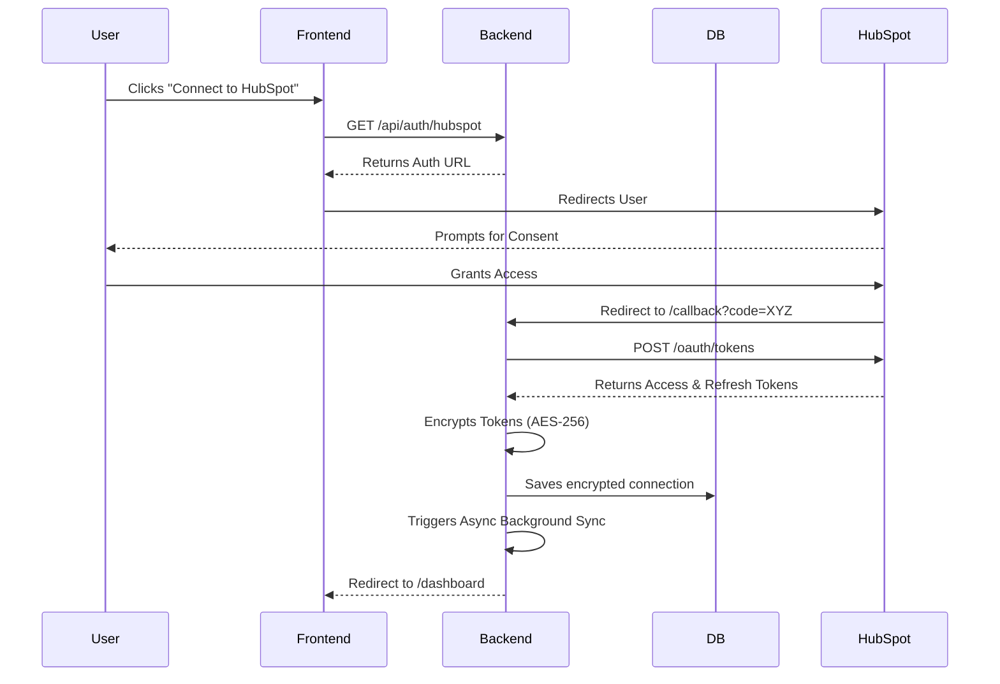

# 2. OAuth Implementation

The application implements the HubSpot OAuth 2.0 flow to authenticate and authorize requests on behalf of the user.

## OAuth Authorization Flow

1.  **Initiation**: The frontend requests the HubSpot authorization URL from the backend (`GET /api/auth/hubspot`).
2.  **User Consent**: The user is redirected to HubSpot to grant permission.
3.  **Callback**: HubSpot redirects the user back to the backend's callback URL (`GET /api/auth/hubspot/callback`) with an authorization `code`.
4.  **Token Exchange**: The backend exchanges the `code` for an `access_token` and a `refresh_token` via HubSpot's `v1/oauth/tokens` endpoint.
5.  **Completion**: The backend stores the tokens and redirects the user back to the frontend dashboard.

## Token Storage

Tokens are managed using the `HubSpotConnection` model and repository.
*   **Encryption**: Access and Refresh tokens are **never** stored in plain text. Before saving to the database, they are encrypted using AES-256-GCM via the `encryption.js` utility. The `ENCRYPTION_KEY` environment variable acts as the master key.
*   **Decryption**: Tokens are decrypted in memory only when required to make API calls to HubSpot.

## Refresh Token Handling

Access tokens expire (usually after 30 minutes). The system handles this proactively and reactively:
*   **Proactive**: Before an API call, the system checks if the access token is expired (by checking `expiresAt` with a 5-minute buffer). If expired, it triggers a refresh.
*   **Reactive (Axios Interceptors)**: If HubSpot returns a `401 Unauthorized` during an API call, the Axios interceptor in `hubspotClient.js` automatically intercepts the error. It pauses all ongoing requests, uses the Refresh Token to obtain a new Access Token, updates the database, and seamlessly retries the original failed request.

## Security Considerations

*   **No Tokens on Client**: The frontend never receives HubSpot tokens. All interactions with HubSpot are securely proxied through the backend.
*   **Encryption at Rest**: Stolen database dumps will not compromise HubSpot accounts due to the AES-256 encryption.

## Sequence Diagram

