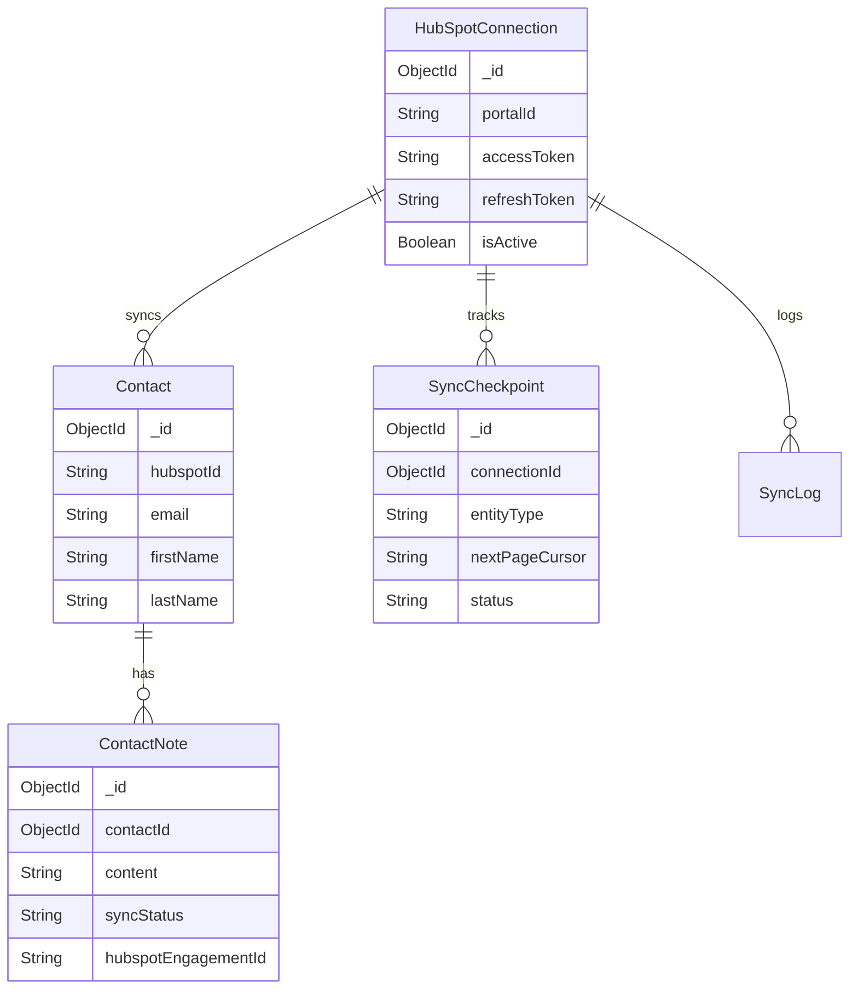

# 3. Database Schema

The application uses MongoDB to store configurations, synced data, and synchronization state. Mongoose is used as the Object Data Modeling (ODM) library.

## Collections

### 1. `HubSpotConnection`
Stores OAuth connection details per user (or tenant).
*   **Fields**: `portalId`, `accessToken` (encrypted), `refreshToken` (encrypted), `expiresAt`, `isActive`.

### 2. `Contact`
Stores synchronized contact records from HubSpot.
*   **Fields**: `hubspotId` (String, unique), `firstName`, `lastName`, `email`, `lastModifiedAt` (from HubSpot), `createdAt`, `updatedAt`.
*   **Indexes**: 
    *   `{ hubspotId: 1 }` (Unique, for fast upsert operations).
    *   `{ email: 1 }` (For searching).

### 3. `ContactNote`
Stores notes created locally and their synchronization status.
*   **Fields**: `contactId` (Ref to Contact), `content`, `syncStatus` (Enum: `pending`, `synced`, `failed`, `perm_failed`), `hubspotEngagementId`, `retryCount`, `lastError`.
*   **Indexes**:
    *   `{ syncStatus: 1, retryCount: 1 }` (For querying failed notes for retries).
    *   `{ contactId: 1, createdAt: -1 }` (For efficiently retrieving a contact's notes timeline).

### 4. `SyncCheckpoint`
Stores pagination cursors for resumable synchronization.
*   **Fields**: `connectionId`, `entityType` (e.g., 'contacts'), `nextPageCursor`, `status` (Enum: `running`, `completed`, `error`), `lastRun`.
*   **Indexes**: `{ connectionId: 1, entityType: 1 }` (Unique).

### 5. `SyncLog`
An audit trail for synchronization operations.
*   **Fields**: `connectionId`, `type`, `status`, `recordsProcessed`, `recordsUpserted`, `error`, `startedAt`, `completedAt`.

## ER Diagram

