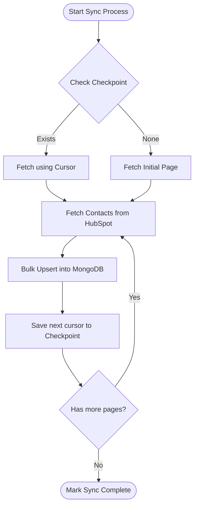

# 4. Automatic Contact Synchronization

The contact synchronization process is designed to be fully automated, resilient, and non-blocking for the user.

## Synchronization Workflow

1.  **Trigger**: Sync is triggered immediately after a successful OAuth connection. It runs asynchronously (`runInitialSync`).
2.  **State Check**: The `SyncService` checks the `SyncCheckpoint` collection to see if a previous sync crashed or failed. If a `nextPageCursor` exists, it resumes from that exact point.
3.  **Fetch & Upsert Loop**:
    *   Fetches a page of contacts from the HubSpot API.
    *   Transforms the data into the local MongoDB schema format.
    *   Executes an idempotent `bulkWrite` operation to insert or update the contacts in the database.
    *   Updates the `SyncCheckpoint` with the `after` cursor provided by HubSpot.
    *   Logs metrics (processed count) to `SyncLog`.
4.  **Completion**: Once HubSpot returns no more cursors, the `SyncCheckpoint` is marked as `completed`, and the `SyncLog` records the total duration and success.

## Duplicate Prevention & Idempotency

Duplicate records are prevented using the `hubspotId` as a unique index in the `Contact` collection.
The sync utilizes MongoDB's `bulkWrite` with `updateOne` and `upsert: true`. 
This operation is strictly **idempotent**:
*   If the contact does not exist locally, it is inserted.
*   If the contact already exists, it is overwritten with the latest data from HubSpot.
*   Running the sync multiple times on the same dataset safely results in the same database state without duplicating rows.

## Resume Mechanism

Interrupted or crashed synchronizations are mitigated via the `SyncCheckpoint` collection. 
Because the pagination cursor is saved *before* fetching the next page, a crashed process can simply query the checkpoint on restart and ask HubSpot for the exact page it was working on when it died.

## Synchronization Workflow Diagram

